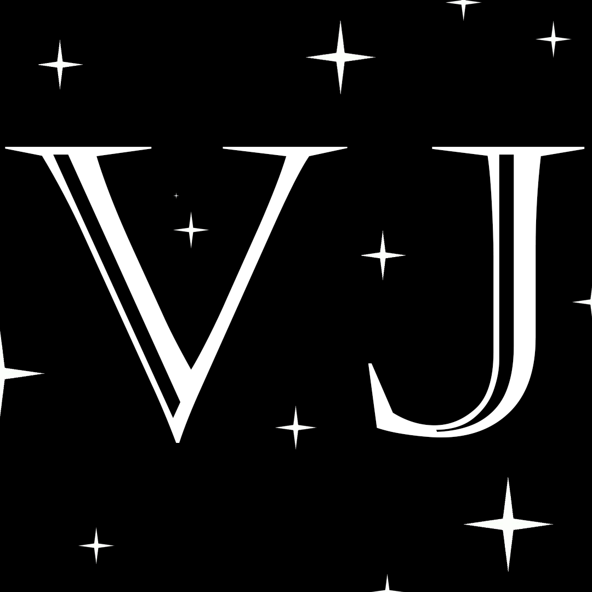

  

# 📰 Website Demo Varich Journal

Semester project for the «Web Technologies» course (2nd year, [TUKE](https://www.tuke.sk/)). The goal of the project was to create a custom website based on an original concept, while completing a set of predefined tasks to develop practical web development skills. You can find the full list of requirements [here](https://peter.bednar.website.tuke.sk/awt/). The chosen theme was a digital magazine, inspired by iconic publications such as [GQ](https://www.gq.com/), [Forbes](https://www.forbes.com/), [Vogue](https://www.vogue.com/), and others.

## 🎯 Goals
### I. Fundamentals of Web Technologies (Frontend Basics)

* Learn the basics of **HTML**.
* Learn how to create **static web pages**.
* Structure HTML using **semantic tags** (e.g., `section`, `article`, etc.).
* Learn **CSS**, including:

  * basic styling,
  * **responsive design**,
  * **print stylesheets**,
  * **transitions**, **animations**, and **transformations**.
* **Validate** HTML and CSS code.
* Get familiar with **browser developer tools**.

### II. Working with JavaScript 
* Learn the **syntax and fundamentals of JavaScript**.
* Understand how to **manipulate the DOM** (Document Object Model).
* Handle and process **form input data**.
* Use **`localStorage`** for storing data on the client side.
* Implement **form validation** using both HTML and JavaScript.
* Use **AJAX (`XMLHttpRequest`)** for asynchronous communication with the server.

### III. Templates and Content Generation

* Transform JavaScript objects into HTML using:

  * **Template literals**.
  * **Mustache templating system**.

* Use Mustache to generate **repeating content blocks**, such as a list of articles.

### IV. Client-side Routing and SPA

* Learn the fundamentals of **Single Page Applications (SPA)**.
* Implement **client-side routing** (navigation without page reloads).
* Organize the SPA structure beetween tabs.

### V. Dynamic Blog Features

* Load and display articles from JSON or a server.
* Add, edit, and delete articles.
* Add and display comments for each article.
* Integrate **Google Sign-In** for user authentication.
 
## 🎥 Demo Video
...

## 🎞️ Key Frames

## 🚀 Features

- **Main Page (`index.html`)**:
  - Journal title and a custom-designed **SVG logo**
  - Brief project description (on the left) and visual examples of magazine covers (on the right)
  - Navigation tabs: *Journal*, *Articles*, *Comments*
  - Button for creating a new article
  - **Google Sign-In** authentication (user name stored in `localStorage`)

- **Article Creation Form**:
  - Fields: author name, title, preview image/link, tags (`datalist`), content (`textarea`)
  - Buttons: *Submit* (send to server), *Reset* (clear form)
  - After submission, the user is automatically redirected to the **Articles** section

- **Articles Section**:
  - Articles are loaded from the server and displayed
  - Each article appears as a card with: preview image, title, author, date, tags
  - Buttons: **Edit** (open editing form), **Delete** (remove article), **Add Comment** (comment on article)
  - Clicking on the article title opens a full article view
  - Pagination is implemented (arrow navigation)

- **Comments Section**:
  - The **+ Add Comment** button opens a comment form
  - Comments are saved in **localStorage**
  - All comments are displayed on the page
  - Pagination allows browsing through all comments
  - This section serves as a global feedback wall for the Varich Journal project

- **Static Articles by Varich Journal**:
  - Separate static pages: `article1.html`, `article2.html`, `article3.html`, `article4.html`
  - Fully **responsive** design
  - Includes **print styles**
  - Uses CSS **animations**, **transformations**, and **transitions**

## 🧑🏻 Author 
Dmytro Varich is the creator of this web-app project. You can learn more about his projects on his personal [Telegram channel](https://t.me/varich_channel), as well as connect with him via LinkedIn ([dmytro-varich](https://www.linkedin.com/in/dmytro-varich/)) and email (varich.it@gmail.com).
